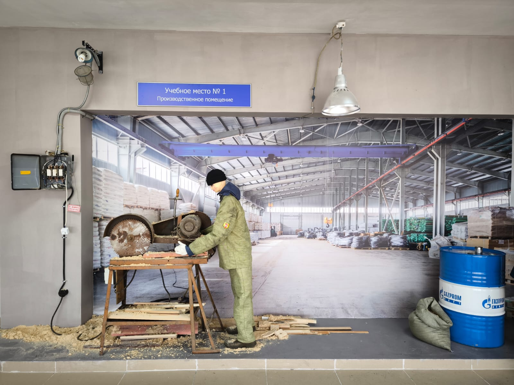

# Криминалистический полигон 
# Производственное помещение

Перейдем к первому учебному месту: **"Производственному помещению"**. На нем находятся такие объекты, как: 
1. Циркулярная пила 
2. Фонари
3. Древесина
4. Проводка
5. Бочка емкостью 200л
